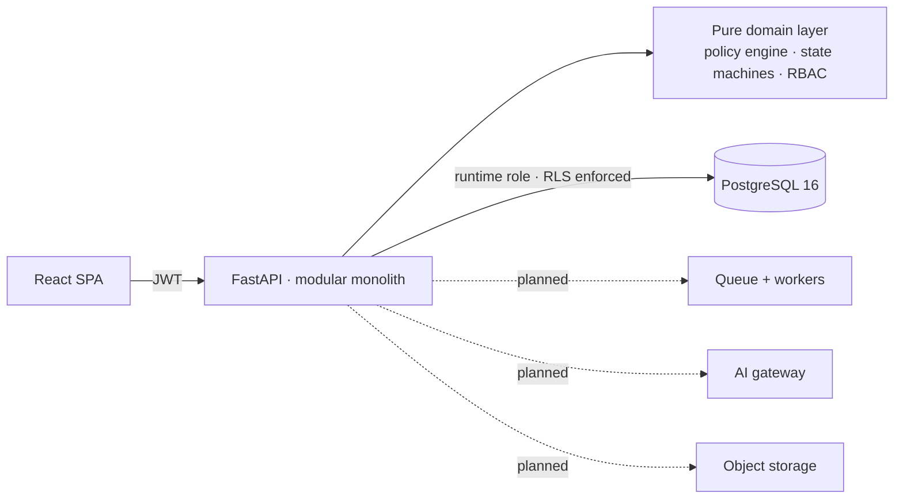

# ProcuraX

### Intelligent B2B Procurement & Spend Transformation Platform

ProcuraX turns e-mail-, spreadsheet- and stamp-chain procurement into a **governed
purchase-to-pay workflow**. Purchasing policy is enforced by a deterministic, versioned rules
engine. Every decision is explainable and auditable. Tenants are isolated down to the database
row. It is the structured foundation on which invoice automation, spend intelligence and AI
decision support are being added, each benchmarked against a baseline before any claim is
made.

> **Operating principle — AI recommends · rules enforce · humans decide.**

**Status:** The core multi-tenant procurement workflow is implemented. P5 adds delegation and
SLA escalation that runs on a schedule inside the API (advisory-locked) or from cron. P6/P7 add
supplier line-price PO pricing, a cumulative three-way match that blocks double billing,
Japan consumption-tax and qualified-invoice (インボイス制度) checks, finance exception decisions and
payment approval requests. P8 includes filtered spend analytics and live budget utilization.
P15 records the sourcing recommendation, the human award decision and its outcome. P11's
Tesseract OCR runs end to end with a synthetic rendered-invoice benchmark; P9/P10/P12/P13 have
offline synthetic baselines. Synthetic metrics are smoke checks, not product performance
claims. Approved payments export as a Zengin (全銀) bank transfer file; ProcuraX never moves
money itself. The assistant retrieves Japanese text, measured on the National Tax Agency's own
invoice-system Q&A. A free, no-card deployment (Render + Neon + GitHub Actions) is scripted and
was rehearsed locally against a Neon-like database. Hosting it needs the owner's free accounts.
No pilot has been run; [illustrative personas](docs/user_personas.md) show the intended users.
See the [roadmap](docs/transformation_roadmap.md).

---

## Business problem

Large organisations often run procurement across e-mail, spreadsheets, ERP exports and
person-to-person approval chains (in Japan, often ringi documents with hanko). The result:
- slow approvals and inconsistently applied thresholds
- spend visible only at month-end
- off-contract and split purchases
- manual invoice keying and reconciliation
- audit evidence scattered across inboxes

The controls exist on paper but are not operationalised.
→ [Full diagnosis: current state, root causes, stakeholders, KPIs, risks](docs/business_problem.md)

## Current state → target state

| | Current state | Target state (ProcuraX) | Built? |
|---|---|---|---|
| Intake | E-mail / Excel | One digital request with line items, cost centre, justification | ✅ |
| Policy | Thresholds applied from memory | Deterministic engine: 21 rules, versioned, every decision cites rule IDs | ✅ |
| Approvals | Ringi / e-mail chain | Chain from the org structure and role pools, SLA, segregation of duties | ✅ |
| Budget | Spreadsheet, checked late | Checked at submit and re-checked under a lock at final approval | ✅ |
| Vendors | Buyer's inbox | Vendor master with onboarding control, risk, contract, invoice registration no. | ✅ |
| Audit | Reconstructed by hand | Append-only trail, enforced by database grants | ✅ |
| PO → receipt → invoice → 3-way match | ERP keying, visual checks | Supplier line prices flow to PO lines; cumulative line match (no double billing); consumption tax per rate; registration number check digit + vendor master; finance exception decision | 🟡 P6–P7; Zengin transfer-file export done; e-invoicing and NTA registry lookup remain |
| Spend visibility | Month-end exports | Live category/department/vendor spend, 12-month trend, cycle percentiles, invoice match summaries and current-FY budget utilization by cost centre | 🟡 P8 partial; savings opportunities and anomaly review remain |

## Architecture

A **modular monolith** (FastAPI, async SQLAlchemy, PostgreSQL 16) with a pure domain layer
(policy engine, state machines, RBAC) and strict module boundaries. The seams for splitting
out document AI and inference later are identified. A React SPA sits on top.



What makes it enterprise-grade rather than CRUD:
- **Two-layer tenant isolation.** Application scoping *and* PostgreSQL Row-Level Security
  (FORCE). The runtime DB role is not the table owner, so a forgotten `WHERE` returns zero
  rows, not another tenant's data. Tested directly against the database.
- **Concurrency-safe money decisions.** Request and budget rows are locked. Two approvals
  that would jointly overspend a budget are serialised, and the second is routed to finance.
  Tested with genuinely concurrent transactions.
- **Explainability.** Each submission stores the policy evaluation and version, so a decision
  can be explained later exactly as it was made.
- **Least privilege in the database.** The app role cannot UPDATE or DELETE audit rows or edit
  the RBAC catalogue.

→ [System design & 11 ADRs](docs/system_design.md) · [Dataset strategy](docs/datasets.md) · [Local verification](docs/local_verification.md) ·
[Product spec](docs/product_spec.md) ·
[Free deployment](docs/deployment.md) · [Illustrative personas](docs/user_personas.md) ·
[RBAC matrix (generated)](docs/generated/rbac_matrix.md) ·
[Policy rules (generated)](docs/generated/policy_reference.md) ·
[OpenAPI (generated)](docs/generated/openapi.json)

## AI and decision support

Offline TF-IDF spend classification, robust amount anomaly detection, pairwise vendor ranking and
BM25 knowledge retrieval are implemented with synthetic smoke evaluations. The OCR adapter uses
local Tesseract when installed; this workspace lacks that runtime. A transparent weighted quote
score remains visible as a sourcing baseline, and an award decision requires an authorized human.
Each future capability must ship with a documented dataset (public where licensed, otherwise
labelled synthetic) and an evaluation:

| Capability | Baseline → advanced | Primary metrics |
|---|---|---|
| Vendor recommendation | Weighted quote baseline → pairwise logistic ranker | Synthetic smoke: NDCG@3 0.7125 → 0.9745; Precision@3 0.5083 → 0.6583. Awards now record recommendation vs. decision vs. outcome, the data a real comparison needs |
| Invoice extraction | Tesseract 5.5.3 + strict labeled-line parser → OCR-tolerant parser (check-digit-confirmed repairs) → document AI / VLM | Held-out **synthetic rendered** invoices, avg field accuracy strict → tolerant: clean 0.97 → 0.99, degraded scan 0.62 → 0.81, low-res 0.71 → 0.75; real invoices unmeasured |
| Spend classification | TF-IDF + logistic regression smoke baseline → embeddings / transformer | Accuracy, macro-F1, per-class F1 |
| Anomaly & duplicate detection | Robust amount baseline / exact duplicate rule → richer signals / similarity | Precision, recall, F1, PR-AUC, FPR |
| Procurement RAG + assistant | Tenant-versioned text sources + BM25 citations + fixed tenant-scoped intents → semantic hybrid retrieval | Official NTA Q&A (171 questions, real data): Recall@5 0.158 → 0.906, MRR@10 0.138 → 0.793; the old ASCII tokenizer found no terms in 100 of them |

AI outputs enter the workflow only as recommendations, and the sourcing award records whether the human followed or overrode the recommendation and why. The policy engine and people make
the decisions ([how the layers interact](docs/product_spec.md#5-ai--deterministic-policy-architecture)).

## Benchmarks

Synthetic model smoke results and a local health-only load run are recorded. Real-dataset model
comparisons and representative authenticated API/database load benchmarks remain unmeasured.
Current implementation verification:

| What | Result |
|---|---|
| Backend API and domain tests | 165 passing; 92% backend line coverage, including tenant isolation, RLS, concurrency (approvals and invoices) and P2P controls |
| Frontend production build | Passed (`tsc -b` + Vite); 437.58 kB JS (127.82 kB gzip), 23.59 kB CSS |
| Backend static checks | Ruff, ruff format and mypy passed |
| API/database migration | Empty database → head → base → head and `alembic check`: no schema drift |
| Invoice OCR | 40 rendered synthetic invoices per condition, held-out seed: see [benchmark report](reports/final_benchmark.md#invoice-ocr-end-to-end) |
| Container stack | Migrate job, API (prod settings) and nginx SPA verified locally with `docker-compose.stack.yml` |
| Japanese retrieval | Official NTA Q&A (171 questions, real data): Recall@5 0.158 → 0.906, MRR@10 0.138 → 0.793 ([report](reports/final_benchmark.md#japanese-retrieval-on-the-official-nta-qa)) |
| Free-tier deployment rehearsal | Migrations, `alembic check`, demo seed + two resets, SLA script and 163 tests passed against a local database whose owner is not a superuser (as on Neon) |

## Business impact

**Not measured yet.** The KPIs are defined with formulas and data sources in
[business_problem.md §5 and §8](docs/business_problem.md#5-business-impact). The
request-level data they need (cycle times, rule hits, budget exceptions) is already captured.
Before/after figures will come only from real telemetry, a pilot, or a simulation explicitly
labelled as such. The parameterized formulas and input rules are in [business_case_model.md](docs/business_case_model.md).

## Live demo

Not publicly hosted yet. A free deployment needs no credit card: follow
[docs/deployment.md](docs/deployment.md) (Neon + Render + GitHub Actions, about 20 minutes). The production-shaped
container stack runs locally with `docker compose -f docker-compose.stack.yml up -d --build`
(see the file header). In development, the demo tenant
*ProcuraX Demo Manufacturing K.K. (fictional)* has 12 personas you can sign in as with one
click, and requests in every state, all produced by the real workflow.

---

## Run it locally

Prerequisites: Docker, [uv](https://docs.astral.sh/uv/), Node 22.

```bash
docker compose up -d                                   # PostgreSQL 16 on :55433 (+ runtime role, test DB)

cd backend
uv sync
uv run alembic upgrade head                            # schema, RLS policies, grants, RBAC catalogue
uv run python -m app.scripts.seed_demo                 # fictional demo tenant (--reset to recreate)
uv run uvicorn app.main:app --port 8000                # API docs: http://localhost:8000/api/v1/docs

cd ../frontend
npm install
npm run dev                                            # http://localhost:5173 (proxies /api → :8000)
```

Optional: install Tesseract (for example `conda create -n procurax-ocr -c conda-forge tesseract`)
and set `PROCURAX_TESSERACT_PATH` / `PROCURAX_TESSDATA_PATH` to enable invoice OCR.

Checks (the same as CI):

```bash
cd backend
uv run ruff check app tests alembic && uv run ruff format --check app tests alembic
uv run mypy app
uv run pytest --cov                                    # needs the docker-compose database
uv run alembic check
uv run python -m app.scripts.gen_docs --check          # generated docs match the code
cd ../frontend && npx oxlint src && npm run build
```

## Repository layout

```
backend/
  app/domain/        pure business logic: policy engine, state machines, RBAC, money, fiscal year
  app/modules/       identity · organization · vendors · procurement · audit (models, schemas, service, router)
  app/core/          config, DB session + tenant binding, security, middleware, logging
  alembic/           migrations (schema + RLS + grants)
  tests/             unit/ and api/ (workflow, tenant isolation, database controls)
frontend/            React 19 + TypeScript + Tailwind SPA
docs/                business problem, product spec, system design, roadmap, generated references
infra/               database bootstrap (roles)
.github/workflows/   CI
```

## Honesty rules this project follows

No fabricated metrics, users, customers, ROI or benchmark results. Synthetic data is labelled
synthetic, and the demo tenant is fictional and excluded from usage metrics. Assumptions are
labelled as assumptions.
