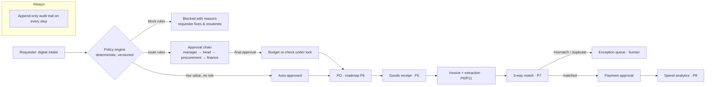

# Business problem — procurement & spend transformation

> **Scope of this document.** The problem statement, current-state diagnosis and target state
> that ProcuraX is designed against. The client below is an **illustrative, hypothetical
> profile** used to make the analysis concrete. It is not a real company, and no figure in this
> document is a measured result. Baselines are *to be measured*. How each one will be measured
> is stated, and nothing is estimated in their place.

## Illustrative client profile (hypothetical)

A mid-to-large Japanese manufacturer with several business units, a shared finance function, a
small central procurement team, and an ERP used mainly for accounting and payment runs.
Purchasing *before* the purchase order is largely outside any system.

This is the situation the platform targets. It is common in organisations whose ERP rollout
covered finance and payments but not procurement intake.

---

## 1. Current-state workflow

| Step | Current tool | Control point today | What is lost |
|---|---|---|---|
| Intake | E-mail, chat, Excel form | None: requests are not registered anywhere | No demand visibility; duplicates go unseen |
| Approval | Ringi (稟議) document or e-mail chain; hanko or reply-all | The approver's memory of thresholds | Inconsistent routing; no SLA; hard-to-prove approval evidence |
| Budget check | Department spreadsheet | Manual, often after the fact | Overspend discovered at month-end |
| Vendor selection | Inbox + Excel comparison | Buyer's judgement | Off-contract and unapproved vendors used ("maverick spend") |
| PO | ERP (keyed manually) | ERP required fields | Re-keying errors; PO disconnected from the approval evidence |
| Receipt | Paper, e-mail | Informal | Partial deliveries not recorded; weak basis for 3-way match |
| Invoice | PDF / paper, manual entry | Visual check | Entry errors, duplicate payments, late-payment penalties |
| Reporting | ERP exports + spreadsheets | Periodic, manual | Spend by vendor/category is weeks old and inconsistent |

## 2. Pain points

| # | Pain point | Observable symptom | How it will be measured in ProcuraX |
|---|---|---|---|
| P1 | Slow approvals | Requesters chase approvers; urgent buys bypass the process | Approval cycle time = `decided_at − submitted_at` (captured per request today) |
| P2 | Inconsistent policy application | Same amount routed differently by different managers | Share of requests whose route came from a rule (100% by design) vs. exceptions granted |
| P3 | No spend visibility until month-end | Budget owners surprised by overspend | Time from commitment to visibility (real time once requests are in-platform) |
| P4 | Maverick / off-contract spend | Purchases from unapproved vendors or without contracts | Count and value of requests hitting VEN-001/002/004/006 |
| P5 | Split purchases | Several small requests that together exceed a threshold | Count of SPL-001 hits |
| P6 | Manual invoice entry & matching | Keying effort; mismatches found late | Invoice processing time and mismatch rate (from P6/P7 stages) |
| P7 | Duplicate payments | Same invoice paid twice | Duplicate-invoice detections blocked (P7/P12 stages) |
| P8 | Weak audit evidence | Evidence scattered across inboxes | Share of decisions with a complete, immutable audit trail (100% in-platform) |

## 3. Stakeholders

| Stakeholder | Goal | Current pain | What they need from the platform |
|---|---|---|---|
| Employee / Requester | Get what the job needs, quickly | Doesn't know status or who to chase | One intake form, live status, clear reasons when blocked |
| Line manager | Approve the team's spend responsibly | Approval requests buried in e-mail | Inbox with context, SLA, one-click decision |
| Department head | Control department budget | Sees overspend late | Budget position at decision time; high-value approvals only |
| Procurement officer | Leverage contracts, manage vendors | Bypassed; learns of purchases after the fact | Early visibility, vendor master, sourcing reviews |
| Finance analyst / manager | Accurate commitments and payments | Month-end reconciliation, duplicate payments | Real-time commitments, budget exceptions routed to them, 3-way match |
| Internal audit / compliance | Prove controls operate | Evidence reconstruction is manual | Immutable audit trail, rule IDs on every decision |
| IT / CIO | Fewer shadow tools; secure platform | Excel and e-mail workflows everywhere | Multi-tenant SaaS with RBAC, SSO roadmap, APIs for ERP |
| CFO | Lower cost-to-procure, fewer leaks | No reliable spend data | Spend analytics, savings and compliance KPIs |
| Vendors | Get paid on time | Invoice status unknown | Vendor portal (roadmap) |

## 4. Root causes

| Category | Root cause |
|---|---|
| Process | No single intake point, so everything downstream is informal. Approval rules exist as documents, not as enforced logic. |
| Technology | The ERP covers PO → payment only. Nothing covers intake, approval or receipt. |
| Data | Vendor master, budgets and spend live in different places with no shared keys. |
| Policy | Thresholds and contract rules are known but not *enforceable*, so compliance depends on individuals. |
| People | Approvers are overloaded with low-value requests that could be auto-approved under clear rules. |
| Regulation | Japan's Qualified Invoice System (インボイス制度, since Oct 2023) and the Electronic Bookkeeping Act (電子帳簿保存法, electronic retention of e-transaction data required since Jan 2024) raise the cost of paper- and e-mail-based invoice handling. |

The core diagnosis: **the controls are defined but not operationalised.** Adding AI on top
of an unstructured process would automate the chaos. The first move is to digitise the
workflow and make policy executable. That creates the structured data that AI components
later need.

## 5. Business impact

Impact is expressed as **parameterised formulas**, not asserted numbers. The parameters are
filled from measurement (pilot telemetry or a labelled controlled simulation, see
`transformation_roadmap.md`), never from assumption presented as fact.

| Impact area | Formula | Parameter sources |
|---|---|---|
| Approval effort | `requests/yr × avg manual touches × minutes/touch` | Request volume and step counts come from the platform. Minutes/touch come from a time study or simulation. |
| Invoice processing cost | `invoices/yr × (entry min + match min) × loaded cost/min` | Measured in the P6/P11 stages |
| Maverick spend exposure | `Σ value of off-contract requests` | VEN-004/006 rule hits (available now) |
| Duplicate-payment exposure | `Σ value of detected duplicates` | Duplicate detection (P7/P12) |
| Budget overrun avoided | `Σ requests routed to finance by BUD-001/002` | Available now; value realised only if finance declines some |
| Cycle time | `median(decided_at − submitted_at)` | Available now for in-platform requests |

## 6. Future-state workflow

Principles:

1. **AI recommends, rules enforce, humans decide.** Models may rank vendors or extract
   invoice fields. Routing, blocking and payment release are decided by rules and by
   accountable people.
2. **Every decision is explainable.** Each outcome cites rule IDs and stores a snapshot of the
   policy version used.
3. **Risk-tiered automation.** Low risk is automatic, medium risk gets a recommendation plus
   one approver, and high risk goes through a multi-step human chain.

## 7. Transformation objectives

| # | Objective | Target setting |
|---|---|---|
| O1 | Route 100% of purchase requests through one digital intake with policy-driven approval | Structural (true once adopted). Measured as the in-platform share of spend. |
| O2 | Make every approval decision explainable and auditable | Structural: every transition writes an audit entry with the rule IDs |
| O3 | Reduce approval cycle time | Baseline measured in pilot; target set as % reduction *after* baseline exists |
| O4 | Reduce off-contract and split-purchase spend | Baseline = first 4 weeks of rule-hit data; target set afterwards |
| O5 | Automate invoice capture and 3-way matching with human exception handling | Stages P6, P7 and P11. Target: field-level F1 set after the baseline model is evaluated. |
| O6 | Real-time spend visibility by department, vendor and category | Stage P8 |

## 8. KPIs

| KPI | Definition | Data source | Available |
|---|---|---|---|
| Approval cycle time | Median and p90 of `decided_at − submitted_at` | `purchase_requests` | Data captured now; dashboard in P8 |
| Step SLA adherence | Share of steps decided before `due_at` | `approvals` | Data captured now |
| Auto-approval rate | Auto-approved ÷ submitted | Audit: `purchase_request.auto_approved` | Now |
| Policy block rate | Blocked ÷ submitted, by rule | `policy_evaluation` snapshots | Now |
| Maverick spend | Value of requests with VEN-001/002/004/006 hits | `policy_evaluation` | Now |
| Split-purchase detections | Count of SPL-001 hits | `policy_evaluation` | Now |
| Budget exceptions | Count/value routed by BUD-001/002 | `policy_evaluation` | Now |
| Invoice processing time | Upload → matched | Invoice module | P6/P7 |
| Invoice mismatch rate | Mismatch ÷ matched invoices | 3-way match | P7 |
| Duplicate invoice rate | Duplicates detected ÷ invoices | Duplicate detection | P7/P12 |
| AI recommendation acceptance | Accepted ÷ shown | `ai_predictions` + human decision | P10+ |
| Adoption | Active users/week, share of spend in-platform | Usage telemetry (demo tenant excluded) | P16 |

## 9. Risks

| Risk | Likelihood | Impact | Mitigation |
|---|---|---|---|
| Users bypass the platform ("just e-mail the buyer") | High | High | Make intake faster than e-mail; procurement refuses off-platform requests; measure the in-platform share |
| Policy configured wrongly, e.g. thresholds too low | Medium | Medium | Versioned policy with change audit; dry-run preview; per-rule analytics |
| Approver bottlenecks | Medium | Medium | SLA due dates, inbox by urgency; delegation and escalation in P5 |
| Budget race: two approvals overspend | Low | High | Budget-row lock and re-check at final approval (implemented and tested) |
| Tenant data leakage | Low | Critical | App-level scoping plus PostgreSQL RLS, both tested |
| Over-trust in AI outputs | Medium | High | AI never overrides rules; confidence and evidence shown; human decision recorded |
| ERP integration delays | High | Medium | Platform is useful standalone; batch export first, API later |
| Regulatory change (invoice rules) | Medium | Medium | Invoice registration number captured on the vendor master; validation rules versioned |

## 10. Assumptions

1. The client's approval thresholds can be expressed as value tiers plus category, vendor and
   budget conditions. The example thresholds (¥30k auto, ¥500k manager, ¥1M procurement) are
   **illustrative configuration**, not recommendations.
2. Budgets are managed per cost centre per fiscal year, with an April start (common in Japan
   but configurable).
3. One requester's line manager and one department head are known for each request. Pools
   (procurement, finance) handle the rest.
4. Single currency per tenant at this stage. Multi-currency is roadmap.
5. The ERP remains the system of record for payments. ProcuraX integrates rather than replaces.
6. Any before/after comparison will be labelled as a **pilot measurement** or a **controlled
   simulation**, never presented as client results.
