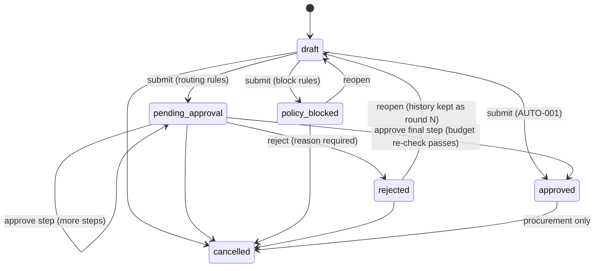
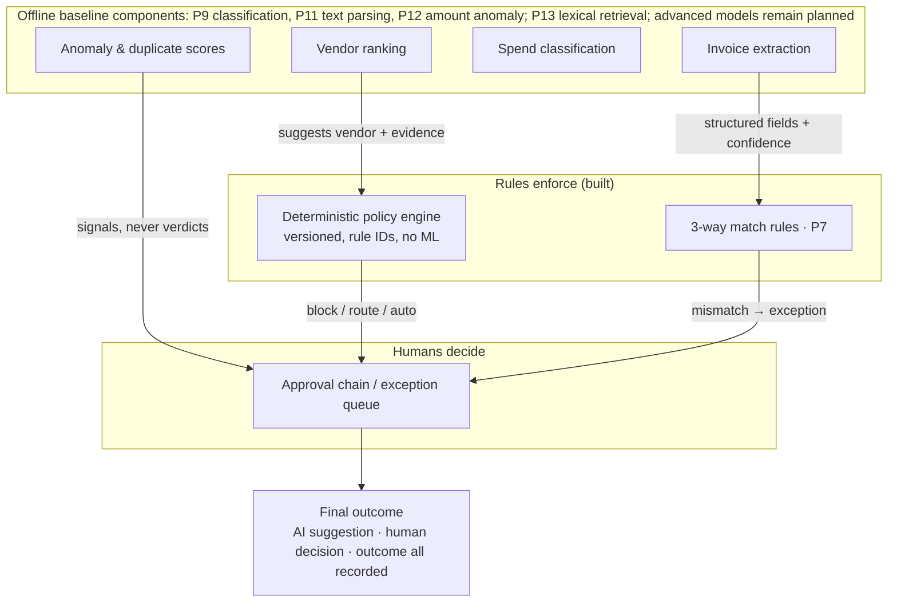

# Product specification — ProcuraX

**ProcuraX** is an enterprise procurement transformation platform. It digitises
purchase-to-pay workflows, automates approvals and invoice reconciliation, provides vendor
decision support, and delivers real-time spend intelligence.

AI is **one component** of the platform, not its identity. The foundation is a governed
digital workflow with deterministic policy enforcement, and AI augments that foundation where
it measurably helps.

Status legend used throughout: ✅ implemented & tested · 🟡 partial · ⬜ roadmap.

---

## 1. Personas and what each can do

| Persona | Role key | Core jobs in the platform | Status |
|---|---|---|---|
| Employee / Requester | `employee` | Raise, edit, submit, cancel and reopen own requests; see status and reasons | ✅ |
| Manager / Approver | `manager` | Approve or reject direct reports' requests; see the team's requests | ✅ |
| Department Head | `department_head` | High-value and emergency approvals; department visibility; budgets | ✅ |
| Procurement Officer | `procurement_officer` | Vendor onboarding and status, issue POs, award quotes, record line receipts and invoice lines, perform sourcing reviews, cancel approved requests | 🟡 |
| Finance Analyst | `finance_analyst` | Read all requests, budgets, analytics | ✅ (analytics summary delivered) |
| Finance Manager | `finance_manager` | Own budgets; approve budget exceptions; decide matched-invoice payment requests; audit read | 🟡 (payment execution ⬜) |
| Vendor | `vendor` | Vendor portal: own POs and invoices | ⬜ (role exists, no portal yet) |
| Organization Admin | `org_admin` | Users, roles, invitations, departments, cost centres, policy versions, audit. **Cannot approve spend.** | ✅ |
| Platform Admin | `platform_admin` | Tenant list and usage only. No tenant business data. Not grantable from a tenant. | ✅ |
| Read-only Analyst | `read_only_analyst` | Read-only requests, vendors, budgets, policy | ✅ |

The full permission × role matrix is generated from code:
[`generated/rbac_matrix.md`](generated/rbac_matrix.md).

**Visibility rules** (row level, inside a tenant). A caller sees:
- their own requests
- their direct reports' requests (if a manager)
- requests charged to departments they head
- any request where they are or were an approver, or belong to the pending step's pool
- everything in the tenant, if they have `purchase_request:read_all`

A request the caller cannot see returns **404, not 403**, so its existence is never revealed.

## 2. Purchase-to-pay workflow

| Step | Status | Notes |
|---|---|---|
| Purchase request (draft → submit) | ✅ | Line items, category, cost centre, preferred vendor, needed-by date, justification, emergency flag |
| Policy validation | ✅ | Deterministic engine, rule catalogue in [`generated/policy_reference.md`](generated/policy_reference.md) |
| Budget check | ✅ | At submission, and again at final approval under a row lock |
| Approval routing | ✅ | Sequential chain from the org structure (manager, department head) plus role pools (procurement, finance) |
| Vendor selection / quote comparison | 🟡 P6 / P10 | Quote intake, transparent weighted score and audited award. Awarded value flows into PO total and is allocated proportionally across request lines; supplier line prices are not captured. Synthetic rule-vs-pairwise-LTR evaluation exists, with no real vendor outcomes. |
| Purchase order | 🟡 P6 | Approved request → PO; status flow includes manual sent/acknowledged, receipt, close and reasoned cancellation; external dispatch is not integrated |
| Vendor confirmation | 🟡 P6 | Manual acknowledgement recorded by procurement; vendor portal not implemented |
| Goods / service receipt | 🟡 P6 | Aggregate accepted/damaged quantity and evidence reference; no item-level receipt |
| Invoice submission + OCR/extraction | 🟡 P6 / P11 | Manual line-level invoice entry (with tax rates and registration number) and a local Tesseract PDF/image extraction preview, benchmarked on synthetic renders. Source files are not persisted and OCR output is not auto-submitted. |
| 3-way match | 🟡 P7 | Per-line price, cumulative billable quantity, consumption tax per rate and registration number checks; finance exception adjudication |
| Finance validation & payment approval | 🟡 P7 | Matched invoice can request payment; finance-manager role decides with self-approval protection. Approved payments export as a Zengin 総合振込 file for bank upload; ProcuraX never moves money |
| Spend analytics | 🟡 P8 | Approved value by category, PO/invoice/payment state counts, and completed request decision-cycle mean/max; department/vendor views, 12-month trend, cycle median/P90, date/dimension filters, CSV export and current-FY cost-centre budget utilization implemented; savings opportunities and anomaly review remain |
| Audit trail | ✅ | Every transition, in the same DB transaction, append-only at DB level |

### Purchase-request state machine

The transition table is enforced in `backend/app/domain/workflow/purchase_request.py`.
Illegal transitions return `409 invalid_state_transition`.

### Approval steps

- Steps run **sequentially** in canonical order: manager (10) → department head (20) →
  procurement (30) → finance (40). Duplicate triggers merge into one step that cites every
  rule ID.
- **Named** steps (manager, department head) come from the org structure. **Pool** steps
  (procurement, finance) can be taken by any holder of the role.
- **Segregation of duties:** a requester can never approve their own request.
- **No double sign-off:** a step assigned to someone who already approved an earlier step in
  the same round is marked `skipped`.
- **Approval SLA:** each activated step gets a `due_at`. Overdue steps are flagged in the inbox.
- **Resubmission:** each submission is a new *round*. Earlier rounds stay as history.

## 3. Exception workflows (spec §4)

| Exception | How it is handled | Status |
|---|---|---|
| Rejected request | Reason required; remaining steps cancelled; requester can reopen and resubmit (new round) | ✅ |
| Approval escalation | SLA due dates and overdue flags ✅. Automatic escalation job ⬜ P5 (needs the worker queue). | 🟡 |
| Delegation | Approver delegates to a deputy for a period | ⬜ P5 |
| Budget exceeded | BUD-002 routes to finance manager at submission; re-checked at final approval under lock | ✅ |
| No budget | BUD-001 routes to finance manager | ✅ |
| Vendor blocked / suspended | VEN-001 blocks the request | ✅ |
| Vendor not approved / high risk / off-contract | VEN-002/003/004/006 route to procurement | ✅ |
| Split purchase below threshold | SPL-001 escalates to the tier the combined amount crosses | ✅ |
| Emergency purchase | Justification required (VAL-003); department head only (APR-005); flagged for retrospective review (EMG-001) | ✅ |
| Cancelled request | Requester (before approval) or procurement (after approval) | ✅ |
| Reopened request | From rejected or policy-blocked back to draft | ✅ |
| Invoice mismatch / duplicate invoice / partial receipt | Aggregate match result, duplicate vendor+number block and receipt quantity validation | 🟡 P6–P7; cumulative line match, finance exception decisions and payment approval delivered |
| Vendor mismatch / cancelled PO | Future exception handling and PO state machine | ⬜ P6–P7 |

## 4. Modules (spec §7)

| Module | Scope now | Status |
|---|---|---|
| A. Procurement request management | Create, draft, edit, submit, cancel, reopen; line items; cost centre; preferred vendor; needed-by; justification | ✅ (attachments ⬜ P6, object storage) |
| B. Approval workflow | Dynamic chain, approve/reject with comments, SLA, audit trail, inbox | 🟡 (delegation plus schedulable audit-logged manager escalation delivered; external notifications remain) |
| C. Vendor management | Onboarding (pending review), profile, categories, contract status, risk, status changes with reasons, Japan invoice registration no. | ✅ (performance/spend history ⬜ P8) |
| D. Quote management | Record vendor amount, delivery, quality, contract compliance; compare with transparent weighted baseline | 🟡 P6 |
| E. Purchase orders | Issue from approved request with approved vendor; audited status transitions | 🟡 P6 |
| F. Goods receipt | Aggregate quantity, damaged quantity, date, comments and evidence reference | 🟡 P6 |
| G. Invoice management | Manual line metadata and duplicate invoice-number guard; optional local OCR preview requires Tesseract and does not persist files | 🟡 P6 / P11 |
| H. 3-way matching | Deterministic PO-line price check, quantity against accepted-not-yet-invoiced, consumption tax with lawful per-rate rounding, qualified-invoice registration check digit and vendor-master match, duplicate block, audited finance exception decision | 🟡 P7; bank transfer is a Zengin file export, not executed by ProcuraX |
| Budgets | Per cost centre per FY; utilisation derived live (committed = approved, pending = in approval) | ✅ |
| Policy administration | Versioned publish with before/after audit; dry-run preview per request | ✅ |
| Users, roles, invitations | Single-use hashed invite tokens; last-admin guard; reporting-cycle guard | ✅ (e-mail delivery ⬜ integration) |

## 5. AI + deterministic policy architecture

Worked examples of the contract between the layers:

| AI says | Rule says | Final |
|---|---|---|
| "Vendor X is the best match" | VEN-001: vendor X is blocked | Request blocked. The AI suggestion is shown but has no effect. |
| "Invoice looks valid (0.97 confidence)" | 3-way match: invoice qty ≠ received qty | Exception queue for manual review |
| "Low anomaly score" | Amount > procurement threshold | Procurement review still required |
| "Probable duplicate (0.91)" | Duplicate rule: same vendor + invoice no. | Payment blocked pending human review |

Rules that are compliance controls (thresholds, blocked vendors, budget, segregation of duties)
are **never** delegated to a model.

## 6. AI capabilities: plan and evaluation contract

No learned model or document-intelligence capability is implemented yet. A deterministic quote
score, exact duplicate key, and fixed-intent analytics assistant are implemented as non-ML
baselines. Advanced capabilities ship only with a documented dataset (real/public where
licensed, otherwise **labelled synthetic**) and the metrics below. Results go to `reports/` with
the dataset version and git commit.

| Capability | Baseline | Advanced | Metrics | Stage |
|---|---|---|---|---|
| Vendor recommendation | Quote-weighted deterministic score (implemented) | Pairwise logistic ranking candidate | NDCG@3, Precision/Recall@3, latency | Synthetic smoke comparison only; synthetic vendor preference artifact; P10 |
| Invoice extraction | Labeled-line parser plus optional local Tesseract OCR adapter | OCR + document AI / VLM | Field P/R/F1, numeric & table accuracy, end-to-end, latency | Synthetic text parser only; Tesseract unavailable in this workspace; P11 |
| Spend classification | TF-IDF + logistic regression (synthetic smoke baseline implemented) | Embedding / transformer classifier | Accuracy, macro/weighted F1, per-class F1, confusion matrix, latency | P9 |
| Spend anomaly detection | Category robust log-MAD amount baseline (synthetic smoke evaluation implemented) | Isolation Forest / GBM | Precision, recall, F1, PR-AUC, FPR | P12 |
| Duplicate invoices | Exact vendor + invoice-number guard (implemented) | Rules + text/embedding similarity | Precision, recall, F1, FPR | P7/P12 |
| Procurement RAG | BM25 over policy rules and tenant-versioned plain-text documents | Hybrid (BM25 + vector) → + reranker | Recall@5/10, MRR, faithfulness, citation correctness, hallucination rate, p95 | Exact-term synthetic retrieval smoke only; P13 |
| Analytics assistant | Fixed allow-listed intent → tenant-scoped ORM query (implemented) | Validated read-only query planning | Execution accuracy on a labelled question set, refusal correctness | P14 (partial) |

## 7. Non-functional requirements

| Area | Requirement | Status |
|---|---|---|
| Tenant isolation | App scoping plus PostgreSQL RLS (FORCE) on every tenant table; fail closed without tenant context | ✅ tested |
| Auditability | Append-only (runtime role has no UPDATE/DELETE); request ID on every entry | ✅ tested |
| Consistency | Row locks on request mutations and budget re-check; atomic document numbering | ✅ tested (incl. concurrency) |
| Security | Argon2id passwords, short-lived JWT, uniform login errors, hashed invite tokens, security headers, strict CORS, production config guards, log-extra redaction | 🟡 (rate limiting, refresh cookies, MFA, external security review remain) |
| Observability | Structured JSON logs, request IDs, `/health` and `/ready` | 🟡 (metrics and tracing ⬜ P19) |
| Performance | Health-only local smoke measured; no product capacity claim | 🟡 P17 authenticated API/database load remains |
| Accessibility / UX | Keyboard-focusable controls, labelled inputs, responsive layout, light/dark themes | 🟡 (no formal audit yet) |

## 8. Data honesty rules

1. Metrics are reported only with their dataset, baseline, configuration and commit.
2. Synthetic data is always labelled synthetic. The demo tenant is labelled **fictional** in
   the UI and flagged `is_demo` in the database.
3. Demo-tenant activity is excluded from usage and adoption metrics.
4. Before/after figures come only from real telemetry, a pilot, or a simulation labelled
   "controlled simulation based on defined assumptions."
5. Business-case scenarios (conservative / expected / aggressive) are labelled as assumptions.
