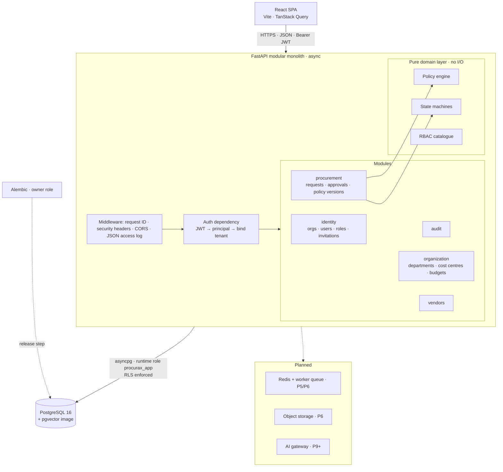
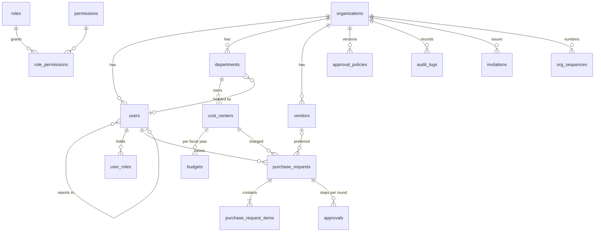

# System design — ProcuraX

Living document. Sections describe **what is built** unless marked *(planned)*. Build status
per stage is tracked in [`transformation_roadmap.md`](transformation_roadmap.md).

## 1. Business requirements

Replace e-mail, spreadsheet and stamp-chain procurement with one governed purchase-to-pay
workflow. Every purchasing decision must be policy-compliant, explainable and auditable, and
the platform must produce structured data for spend intelligence and AI.
See [`business_problem.md`](business_problem.md).

## 2. Functional requirements (current scope)

- Multi-tenant registration; users, roles and invitations; org structure (departments, cost
  centres); budgets per cost centre per fiscal year.
- Purchase requests with line items; deterministic policy evaluation; sequential approval
  chains; reject, cancel and reopen; resubmission rounds.
- Vendor master with onboarding status, risk, contract status and categories.
- Versioned approval policy with dry-run preview.
- Append-only audit trail; per-request timeline.

The full list, with status per item, is in [`product_spec.md`](product_spec.md).

## 3. Non-functional requirements

| Quality | Requirement | How it is met today |
|---|---|---|
| Isolation | No cross-tenant read or write, even with an application bug | App scoping + PostgreSQL RLS (FORCE), fail-closed |
| Integrity | No lost updates, overspend races or duplicate numbers | Row locks, budget re-check under lock, atomic sequence upsert, DB constraints |
| Auditability | Every state change traceable to an actor, rule and request | Audit entry in the same transaction; runtime role cannot UPDATE/DELETE audit rows |
| Explainability | Every routing/blocking decision cites rules | Policy evaluation snapshot stored on the request, with its policy version |
| Security | OWASP-aware defaults | See §9 |
| Operability | Health/readiness, structured logs, request IDs | Implemented; metrics and tracing planned (P19) |
| Performance | Measured, not assumed | A local `/health` smoke was measured; no authenticated API or database capacity claim. See P17. |

## 4. Architecture

### Why a modular monolith

A single deployable service with **strict module boundaries**. Each module owns its models,
schemas, service and router. Cross-module access goes through service functions, and the pure
domain layer has no framework or I/O imports.

It is not split into microservices because:
- one team, one release cadence;
- the workflow needs cross-entity transactions (request + approvals + budget lock + audit in
  one commit), which microservices would turn into sagas without any business benefit;
- the operational cost (service mesh, distributed tracing, per-service deploys) buys nothing
  at this scale.

Seams already exist for extraction later: the invoice/OCR pipeline and AI inference are the
first candidates, because they have different scaling profiles (CPU/GPU-bound, bursty) and can
be asynchronous. See ADR-001.

### Request lifecycle (one API call)

1. `RequestContextMiddleware` assigns or propagates `X-Request-ID` and adds security headers.
2. `get_principal` decodes the JWT, then **binds the tenant**: `session.info["org_id"]`. The
   SQLAlchemy `after_begin` hook runs `set_config('app.org_id', …, true)` at the start of every
   transaction.
3. Permission guard (`requires(Permission.X)`) returns 403 on failure.
4. The service loads rows with explicit `org_id` filters and a role-based visibility clause;
   mutations take `SELECT … FOR UPDATE`.
5. Pure domain functions decide (policy engine, state machine).
6. Changes and audit entries are committed in **one transaction**.
7. The response uses one error envelope `{error: {code, message, details}, request_id}`.

## 5. Component design

| Component | Responsibility | Key files |
|---|---|---|
| Policy engine | `evaluate(facts, policy) → PolicyEvaluation` (outcome, ordered steps, rule hits, budget check). Pure and deterministic. | `app/domain/policy/engine.py` |
| PR state machine | Legal transitions; raises `InvalidStateTransitionError` | `app/domain/workflow/purchase_request.py` |
| Procurement service | Facts assembly, submit, approve, reject, cancel, reopen, inbox, visibility | `app/modules/procurement/service.py` |
| Assignee resolution | Manager → falls back to department head; head requesting → own manager; procurement/finance → pool | `_resolve_assignee` |
| Budget service | Committed/pending derived live from requests; `find_budget(for_update=True)` | `app/modules/organization/service.py` |
| Audit | `record()` in the caller's transaction; `for_entity()` timeline | `app/modules/audit/service.py` |
| Numbering | `INSERT … ON CONFLICT DO UPDATE … RETURNING`, per tenant per year | `app/core/sequences.py` |

## 6. Data architecture

The ERD is centred on the tenant. Every business table carries `org_id` (FK →
`organizations`) with an index.

Conventions:
- **UUID primary keys**, generated app-side, so they are known before the insert and never
  guessable across tenants. Human-readable numbers (`PR-2026-000042`) are per-tenant sequences.
- **Money** is `NUMERIC(18,2)` plus a currency code. It travels as a decimal string in JSON
  and is never a float.
- **Status vocabularies** are CHECK constraints, not PostgreSQL ENUMs (ADR-006).
- **Soft delete** (`deleted_at`) on organisations, users, departments and vendors. Transactional
  records are never deleted; they are cancelled.
- **Timestamps** are `timestamptz`, set app-side (ADR-011). The audit log uses an identity
  `seq` for strict ordering.
- **Constraints** carry business invariants: positive quantities, non-negative amounts, one
  active policy per tenant (partial unique index), case-insensitive unique vendor name per
  tenant (functional index excluding soft-deleted rows), invoice registration number format
  `^T\d{13}$`, lower-case e-mails.
- **Indexes** follow the access paths: inbox (`org_id, status, approver_role` /
  `assigned_user_id`), lists (`org_id, status`, `org_id, requester_id, created_at`), vendor
  category search (GIN on `categories`, queried with `@>`).

Implemented tables *(P5–P13)*: `approval_delegations`, `vendor_quotes` (including award
attribution), `purchase_orders`, `purchase_order_items`, `goods_receipts` (linked to PO lines),
`invoices` (manual line metadata, JSONB line match evidence and finance review fields), `payments`
(approval record only; no transfer integration), and tenant-scoped versioned
`procurement_knowledge_documents`.

Planned tables *(P6–P14)*: invoice line items, `spend_transactions`, `documents`, `ai_predictions`,
`notifications`, `feedback`.

## 7. AI architecture *(offline baselines delivered; full AI pipeline planned)*

Current offline components are a synthetic-data TF-IDF/logistic regression spend classifier,
a robust log-MAD amount outlier baseline, a pairwise vendor ranker with synthetic evaluator, a
deterministic parser for labeled invoice text with an OCR-tolerant mode, a local Tesseract/PDF
OCR adapter (benchmarked end to end on synthetic renders), and BM25 retrieval over
tenant-versioned text sources plus versioned policy rules. The assistant returns active
threshold configuration and cited source excerpts. Sourcing awards persist the baseline
recommendation, the human decision and any override reason (`vendor_quotes.award_context`).
No AI result is connected to automatic approval or payment.

- An **AI gateway** module wraps every model call. It records inputs, output, confidence,
  latency, model version and the eventual human decision in `ai_predictions`. This is the
  basis for acceptance and override metrics and for drift detection.
- AI outputs enter the workflow only as **recommendations or signals**. The policy engine and
  match rules decide, and people approve (see product spec §5).
- Retrieval uses pgvector in the same PostgreSQL, under the same RLS, so tenant-aware retrieval
  is structural and not a filter someone could forget (ADR-002).
- The analytics assistant will generate SQL only against **read-only, RLS-bound views**,
  validate it with a parser allow-list, and run it as a read-only role with a statement
  timeout.

## 8. Integration architecture *(planned)*

| Integration | Pattern | Notes |
|---|---|---|
| ERP (PO, vendor master, payments) | Outbound events + batch export (CSV/SFTP), then REST API | Platform works standalone if the ERP is down; outbox table for retries |
| Identity provider | OIDC SSO | Replaces passwords for enterprise tenants |
| E-mail | Transactional provider | Invitations, approval notifications |
| Object storage | S3-compatible, pre-signed uploads | Attachments, invoices; malware and file-type scanning before processing |
| Payment / accounting sandbox | Webhooks | Payment status back into the P2P record |

Idempotency: external writes will carry an idempotency key stored with the outbox row.
Consumers dedupe on it.

## 9. Security architecture

| Control | Implementation |
|---|---|
| Authentication | Argon2id password hashes; HS256 JWT (60 min) with `sub`, `org`, `typ`, `jti`; uniform "invalid e-mail or password" plus a dummy-hash check against user enumeration |
| Session hardening *(P18)* | Refresh token in an httpOnly cookie, in-memory access token, rotation and revocation, MFA/SSO |
| Authorisation | Permission guards per endpoint plus row-level visibility clause; 404 for invisible rows |
| Tenant isolation | App scoping + RLS with `FORCE ROW LEVEL SECURITY`. The runtime role is neither owner nor superuser. The bypass is explicit (`system_session`) and used only for login, invitation acceptance and platform-admin tenant listing. |
| Least privilege (DB) | Runtime role: DML only; `audit_logs` INSERT/SELECT only; RBAC catalogue read-only; no access to `alembic_version` |
| Input validation | Pydantic schemas with bounds, patterns and enum types; DB CHECK constraints as the last line |
| Secrets | Env vars; startup refuses the default JWT secret in `prod`; `.env` ignored by git |
| Headers | `nosniff`, `X-Frame-Options: DENY`, `Referrer-Policy`, `Permissions-Policy`, COOP; strict CORS allow-list, no credentials |
| Invitations | 256-bit random tokens, stored as SHA-256, single use, 72 h expiry, revocable |
| SQL injection | ORM / bound parameters everywhere. The only interpolated DDL identifier (the role name in the migration) is regex-validated. |
| Rate limiting *(P18)* | Login and invitation endpoints first (Redis token bucket) |
| AI-specific *(planned)* | Prompt-injection isolation for retrieved text, tenant-aware retrieval via RLS, tool allow-list, read-only SQL role, output validation |

## 10. Multi-tenancy model (ADR-004)

Shared database, shared schema, `org_id` on every row. There are two independent layers:

1. **Application.** Every query filters on `principal.org_id`. Lookups by ID check `org_id`
   and return 404 on mismatch.
2. **Database.** The RLS policy on every tenant table:
   `org_id = NULLIF(current_setting('app.org_id', true), '')::uuid OR current_setting('app.rls_bypass', true) = 'on'`.
   The setting is transaction-local (`set_config(…, true)`) and re-applied at every
   transaction start, so it can't leak across pooled connections. With no setting, the
   predicate matches nothing, so the database **fails closed**.

Tested directly as the runtime role (`tests/api/test_database_controls.py`): unfiltered
queries return only the bound tenant's rows; cross-tenant inserts are rejected by `WITH CHECK`;
no tenant context returns zero rows. Tested through the API
(`tests/api/test_tenant_isolation.py`): requests, approvals, vendors, budgets, users,
departments, cost centres, audit logs, inbox, timelines and cross-tenant references.

## 11. Scalability *(design intent; nothing load-tested yet)*

- The API is stateless (JWT), so it scales horizontally behind a load balancer. Each instance
  holds an async connection pool.
- PostgreSQL first scales vertically, then gets read replicas for analytics and a PgBouncer
  pool in transaction mode. That is compatible with our design because tenant context is
  transaction-local.
- Tenant-leading composite indexes keep per-tenant queries selective as total volume grows.
  Partitioning `audit_logs` and future `spend_transactions` by time is the next lever.
- Heavy or bursty work (OCR, embeddings, batch anomaly scoring, reports) moves to workers off
  the request path *(P5/P6)*.

## 12. Reliability & failure handling

| Failure | Behaviour |
|---|---|
| Concurrent approvals of one request | Row lock serialises them. The second caller sees the new state and gets a 409 if its action is no longer valid. |
| Concurrent final approvals on one budget | Budget-row lock plus re-check. The later one is routed to finance with BUD-002. Tested; see note below. |
| Double submit / double click | Row lock + state machine means exactly one transition; the second gets a 409 |
| Unique violations (codes, names, budgets) | Caught at flush and returned as a clear 409 |
| DB unavailable | `/ready` returns 503 so the load balancer drains; `/health` stays up for liveness |
| Unhandled error | Logged with request ID; generic 500 envelope (no stack traces to clients) |
| Migration failure | Runs as a separate release step before new instances start; migrations are reversible and round-trip tested |

Note on the concurrency test: it drives two genuinely concurrent DB transactions. With the
lock removed, it failed in 1 of 3 runs (the race is timing-dependent), so it detects the bug
probabilistically, not on every run.

## 13. Observability

Implemented: one JSON log line per request (method, route template, status, duration, request
ID); request ID echoed in responses and stored on audit rows; `/health` (liveness) and `/ready`
(DB check).

Planned *(P19)*: Prometheus metrics (latency histograms per route, DB pool, queue depth, worker
failures, AI latency, tokens and confidence), Grafana dashboards, OpenTelemetry traces.

## 14. Deployment *(P4, platform to be chosen)*

- Static SPA on a CDN; API as the Docker image (`backend/Dockerfile`, multi-stage, non-root
  uid 10001, image health check); managed PostgreSQL; HTTPS everywhere.
- Release: `alembic upgrade head` (owner credentials) → start new API instances → `/ready`
  gate → shift traffic. Rollback is the previous image; schema changes follow
  expand/contract, so the previous image stays compatible.
- CI (`.github/workflows/ci.yml`): lint → types → migration round-trip and drift check → tests
  with coverage → generated-docs check → dependency audit → frontend type/lint/build/audit →
  image build.

## 15. Cost model *(P20)*

Parameterised per request, invoice, assistant query and 1,000 transactions. Inputs will be
measured resource usage (from P17/P19) multiplied by the chosen provider's list prices, which
are cited with their date. No numbers until then.

## 16. Technology choices

| Question | Choice | Why |
|---|---|---|
| Why PostgreSQL? | PostgreSQL 16 | Relational integrity for a financial workflow (FKs, CHECKs, transactions, row locks); RLS for tenant isolation; JSONB for policy snapshots; pgvector for RAG in the same security boundary; mature managed offerings |
| Why FastAPI? | FastAPI + Pydantic v2 + SQLAlchemy 2 async | Typed request/response contracts, generated OpenAPI, async I/O suits DB-bound work now and LLM calls later; the Python ecosystem matches the ML stack |
| Why Redis / an event queue? | **Not yet.** SLA escalation runs as a schedulable DB command; queue-backed notifications and OCR remain future work. | Current timed work is bounded and idempotent. Add a durable queue when external notification delivery, OCR volume or model jobs need retries and dead-letter handling. |
| Why a deterministic policy engine? | Pure Python rules, versioned config | Compliance controls must be reproducible, testable and explainable to auditors; an LLM is none of those |
| Why a ranking model for vendors *(planned)*? | Learning-to-rank vs a rule baseline | The task is ordering candidates by expected outcome from tabular history, which is what LTR is built for. An LLM adds cost and non-determinism without tabular signal. |
| Why RAG? | BM25 over policy rules and tenant-versioned plain-text documents; hybrid retrieval + reranker planned | Policy answers need traceable source text. Ingestion and extractive citations exist; semantic embeddings and representative retrieval evaluation remain future work |
| Why human approval? | Risk-tiered HITL | Financial commitments need accountable people; automation handles low risk only |

## 17. Architecture Decision Records

**ADR-001 Modular monolith over microservices.** *Context:* one team; the workflow needs
multi-entity transactions. *Decision:* a single service with module boundaries and a pure
domain layer. *Consequences:* simple deploys and ACID workflows. Extraction candidates
(document AI, inference) are identified; boundaries must be policed in code review.

**ADR-002 PostgreSQL as the single datastore, pgvector for vectors.** *Decision:* avoid a
separate vector DB. *Consequences:* one backup and security model, and RLS covers embeddings.
If vector scale outgrows it, revisit with measurements.

**ADR-003 Async FastAPI + SQLAlchemy 2.** *Consequences:* high I/O concurrency. Lazy loading is
disallowed in async, so loads are explicit (`selectin` or column queries), and timestamps are
set app-side (ADR-011).

**ADR-004 Shared-schema multi-tenancy with RLS.** *Alternatives:* schema-per-tenant (migration
fan-out, pool fragmentation) and DB-per-tenant (cost, ops). *Decision:* shared schema, `org_id`
everywhere, RLS as defence-in-depth, a non-owner runtime role, and FORCE RLS for managed
platforms where the owner is not a superuser. *Consequences:* cheap tenants and uniform
migrations; the `system_session` bypass must stay narrow.

**ADR-005 Deterministic policy engine; AI never decides policy.** *Consequences:* every
decision is reproducible from (facts, policy version). The evaluation snapshot is stored on
the request. Adding a rule means code, a test and a catalogue entry.

**ADR-006 CHECK constraints instead of PostgreSQL ENUM types.** Adding a status is a one-line
migration with no type rewrite. The vocabulary is generated from the Python enums.

**ADR-007 Bearer JWT now, cookie-based refresh later.** Short-lived access token in
sessionStorage for the first public stage; P18 moves to an httpOnly refresh cookie with an
in-memory access token and adds revocation.

**ADR-008 Budget utilisation derived, not stored.** Committed and pending amounts are computed
from requests, so they cannot drift. Correctness under concurrency comes from locking the
budget row at final approval. Revisit with a ledger table when POs and invoices add actuals
(P6/P7).

**ADR-009 Resubmission creates a new approval round.** History is immutable and a rejected
chain is never overwritten. The current round is `submission_count`.

**ADR-010 Named approvers are authorised by the org structure.** A user assigned by reporting
line or department headship may act on that step even without the generic approver role.
Pool steps require the role. This prevents stuck workflows while keeping pools permissioned.

**ADR-011 App-side timestamps.** `created_at`/`updated_at` are set in Python so no implicit
refresh (I/O) is needed under asyncio. The audit log adds an identity `seq` because timestamps
can tie within one transaction.
